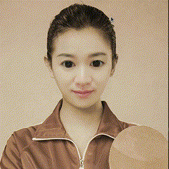

## OpenGL实现美颜相关功能的demo库
说明：这是opengl实现美颜和贴纸的demo库，依赖于OpenGL环境。
Opengl >= 3.3  
GLFW + GLAD
### 使用方法：
mkdir build && cd build  
cmake ..
make -j *
### demo可视化结果：
#### 美型：
　　大眼、瘦脸

#### 美颜：
　　美白、磨皮、锐化
#### 2d贴纸

TODO：
- [ ] 完善剩余功能